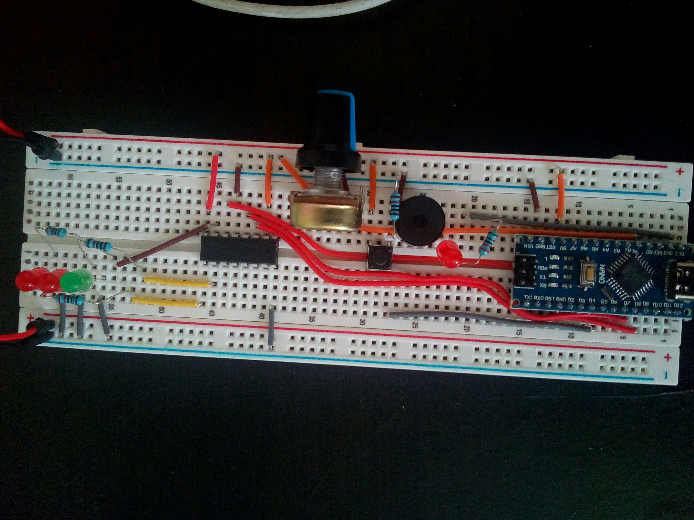
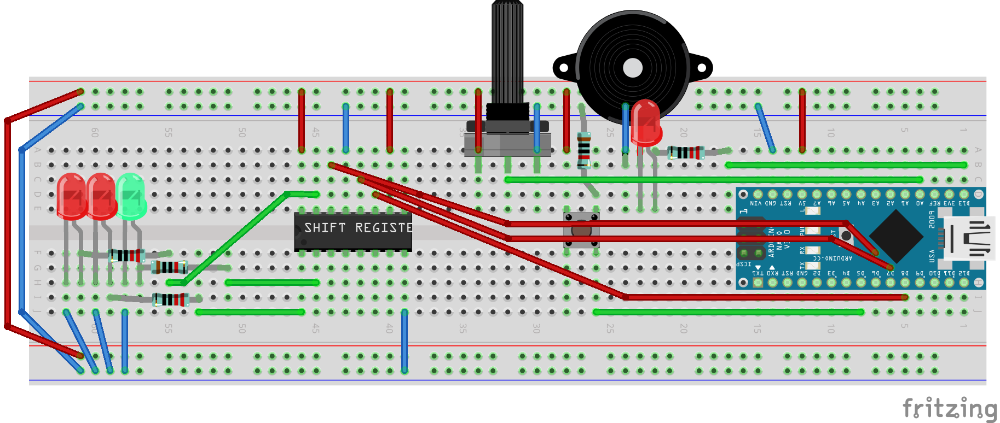
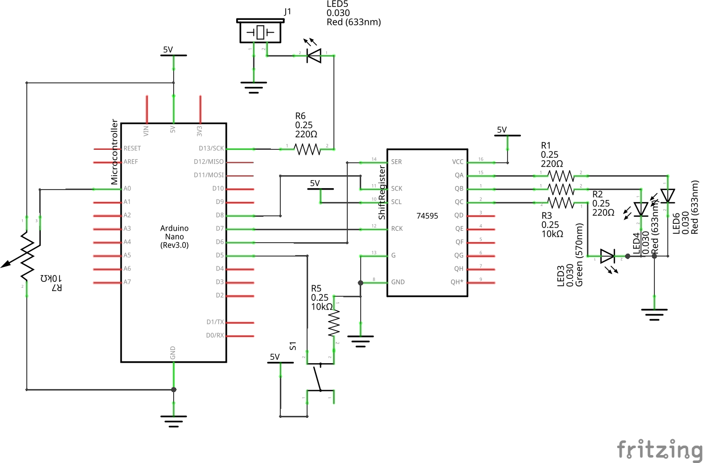

# Arduino Soundbox of Accolade Grand Prix game

Accolade Grand Prix 1 `GPEGA.EXE` was one of my childhood PC game and I made an Adruino soundbox of it, jff.

## Photo

## Breadboard

## Schematics

## Demo
[https://www.youtube.com/watch?v=L9yvqNz5c0s](https://www.youtube.com/watch?v=L9yvqNz5c0s)